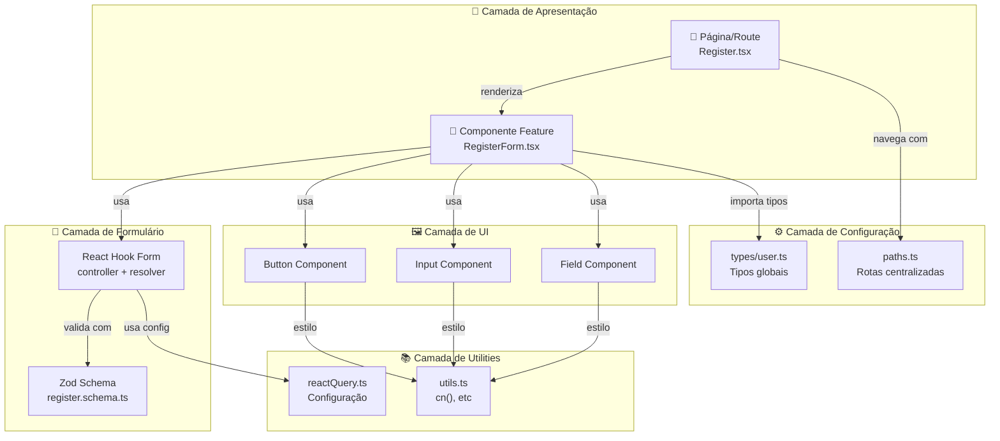
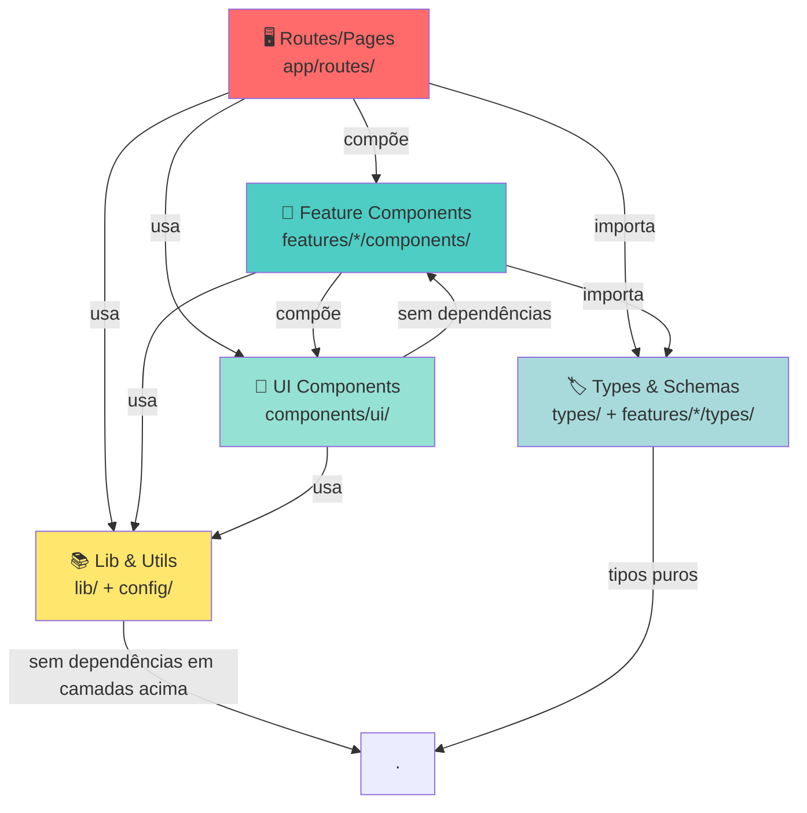
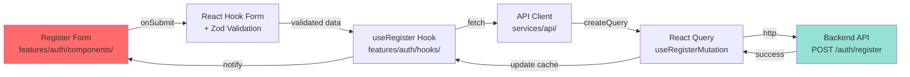

# Quyro Tech - Frontend Architecture

> Padrão oficial de arquitetura front-end da Quyro Tech. Uma documentação viva que descreve a estrutura, padrões e princípios de design de componentes e aplicações.


---

## 📋 Sumário

- [Visão Geral](#visão-geral)
- [Estrutura do Projeto](#estrutura-do-projeto)
- [Arquivos de Configuração](#arquivos-de-configuração)
- [Fluxo de Dados e Comunicação](#fluxo-de-dados-e-comunicação)
- [Começando](#começando)
- [Decisões Arquiteturais](#decisões-arquiteturais)
- [Convenções e Padrões](#convenções-e-padrões)

---

## 🎯 Visão Geral

Este projeto define o **padrão oficial de arquitetura front-end** para todas as aplicações da Quyro Tech. É construído com **Vite**, **React 19**, **TypeScript**, **TailwindCSS** e outras tecnologias modernas.

### Objetivos Principais

- ✅ **Consistência**: Estrutura padronizada em todos os projetos
- ✅ **Escalabilidade**: Fácil crescimento e adição de features
- ✅ **Manutenibilidade**: Código limpo e bem organizado
- ✅ **Reutilização**: Componentes e utilitários compartilháveis
- ✅ **Type-Safety**: TypeScript em todo o projeto
- ✅ **Performance**: Otimizações built-in com Vite e React Query

---

## 📁 Estrutura do Projeto

```
quyro-tech-frontend-architecture/
├── public/                          # Arquivos estáticos servidos diretamente
├── src/
│   ├── app/                        # Camada de aplicação (App, routing, providers)
│   │   ├── index.tsx               # Componente raiz da aplicação
│   │   ├── Provider.tsx            # Provedores globais (React Query, etc)
│   │   ├── Router.tsx              # Configuração de rotas
│   │   └── routes/                 # Componentes de página/rota
│   │       ├── Home.tsx            # Página inicial
│   │       ├── NotFound.tsx        # Página 404
│   │       └── auth/
│   │           └── Register.tsx    # Página de registro
│   ├── components/                 # Componentes reutilizáveis
│   │   └── ui/                     # Componentes de UI primitivos (Button, Input, etc)
│   │       ├── button.tsx
│   │       ├── card.tsx
│   │       ├── field.tsx
│   │       ├── input.tsx
│   │       ├── label.tsx
│   │       └── separator.tsx
│   ├── config/                     # Configurações centralizadas
│   │   └── paths.ts                # Rotas/caminhos da aplicação
│   ├── features/                   # Funcionalidades em escopo (domínios)
│   │   └── auth/                   # Feature: Autenticação
│   │       ├── components/         # Componentes específicos da feature
│   │       │   └── RegisterForm.tsx
│   │       ├── schemas/            # Esquemas Zod para validação
│   │       │   └── register.schema.ts
│   │       ├── services/           # (Futuro) Serviços de API e lógica
│   │       └── types/              # Tipos TypeScript específicos
│   │           └── auth.types.ts
│   ├── lib/                        # Utilitários e configurações compartilhadas
│   │   ├── reactQuery.ts           # Configuração do React Query
│   │   └── utils.ts                # Funções utilitárias globais
│   ├── types/                      # Tipos globais compartilhados
│   │   └── user.ts                 # Tipos de domínio (User, Role, etc)
│   ├── main.tsx                    # Ponto de entrada da aplicação
│   └── index.css                   # Estilos globais e Tailwind
├── index.html                      # HTML raiz
├── vite.config.ts                  # Configuração do Vite
├── tsconfig.json                   # Configuração raiz do TypeScript
├── tsconfig.app.json               # Configuração do TypeScript para a app
├── tsconfig.node.json              # Configuração do TypeScript para build tools
├── biome.json                      # Configuração do Biome (linting/formatting)
├── package.json                    # Dependências e scripts
└── components.json                 # Configuração de componentes (shadcn)
```

### Descrição Detalhada das Pastas

#### 📦 `src/app/`
**Responsabilidade**: Orquestração da aplicação

- **O que pertence aqui**: Componentes raiz, configuração de rotas, provedores de contexto global
- **O que NÃO pertence**: Lógica de negócio, componentes de UI reutilizáveis, utilitários

**Arquivos**:
- `index.tsx`: Componente raiz que compõe `Provider` + `Router`
- `Provider.tsx`: Wraps da aplicação com `QueryClientProvider` e outros contextos globais
- `Router.tsx`: Configuração de rotas com React Router v7 (lazy loading de componentes)
- `routes/`: Componentes de página associados a rotas

---

#### 🎨 `src/components/`
**Responsabilidade**: Componentes UI reutilizáveis e genéricos

- **O que pertence aqui**: Componentes primitivos (Button, Input, Card), componentes layout (Grid, Container)
- **O que NÃO pertence**: Componentes específicos de features, lógica de negócio

**Subfolder `ui/`**:
- Componentes base (shadcn/ui inspired)
- Sem dependências de features específicas
- Props genéricas e reutilizáveis
- Estilizados com TailwindCSS e `class-variance-authority` para variantes

---

#### ⚙️ `src/config/`
**Responsabilidade**: Configurações centralizadas e constantes

- **O que pertence aqui**: Rotas, endpoints de API, constantes globais
- **O que NÃO pertence**: Lógica de negócio, componentes

**Arquivo `paths.ts`**:
```typescript
export const paths = {
  home: { path: '/', getHref: () => '/' },
  auth: {
    register: {
      path: '/auth/register',
      getHref: (redirectTo?: string) => `/auth/register?redirectTo=${redirectTo}`
    }
  }
}
```
- Centraliza definições de rotas
- Funções `getHref()` permitem passar parâmetros de forma tipada
- Evita string hardcoding em componentes

---

#### 🎯 `src/features/`
**Responsabilidade**: Funcionalidades organizadas por domínio/feature

- **O que pertence aqui**: Toda a lógica, componentes, tipos e esquemas de uma feature
- **O que NÃO pertence**: Componentes reutilizáveis genericamente

**Estrutura de uma feature** (ex: `auth/`):
```
features/auth/
├── components/       # Componentes específicos da feature
├── schemas/          # Validação (Zod)
├── services/         # (Futuro) API calls e lógica
├── hooks/            # (Futuro) React hooks customizados
└── types/            # Tipos específicos da feature
```

**Exemplo `features/auth/types/auth.types.ts`**:
```typescript
import type { User } from '@/types/user';

export type RegisterResponse = {
  user: User;
  token: string;
};
```

**Isolamento**: Cada feature é independente. A feature `auth` não importa de `features/dashboard`.

---

#### 📚 `src/lib/`
**Responsabilidade**: Utilitários, configurações e setup de libraries

- **O que pertence aqui**: Configuração do React Query, funções utilitárias globais
- **O que NÃO pertence**: Lógica de negócio, componentes

**Arquivo `reactQuery.ts`**:
- Configuração padrão para `QueryClient`
- Tipos helper (`ApiFnReturnType`, `QueryConfig`, `MutationConfig`)
- Customização centralizada de comportamento de queries/mutations

**Arquivo `utils.ts`**:
```typescript
export function cn(...inputs: ClassValue[]) {
  return twMerge(clsx(inputs));
}
```
- Utilitário para merge de classes Tailwind com segurança

---

#### 🏷️ `src/types/`
**Responsabilidade**: Tipos globais compartilhados

- **O que pertence aqui**: Tipos de domínio (User, Roles), tipos genéricos
- **O que NÃO pertence**: Tipos específicos de features (coloque em `features/*/types/`)

**Exemplo `types/user.ts`**:
```typescript
export type User = {
  id: string;
  name: string;
  email: string;
  roles: 'ADMIN' | 'USER';
};
```

---

#### 🎪 `src/` - Raiz
- `main.tsx`: Inicializa React no elemento `#root` do HTML
- `index.css`: Imports do TailwindCSS, animations, custom themes

---

## ⚙️ Arquivos de Configuração

### 📦 `package.json`
Define dependências e scripts do projeto.

**Dependências principais**:
- `react` / `react-dom`: Framework UI
- `react-router`: Roteamento client-side
- `@tanstack/react-query`: Gerenciamento de estado async
- `tailwindcss` / `@tailwindcss/vite`: Styling
- `zod`: Validação de dados
- `react-hook-form`: Gerenciamento de formulários
- `radix-ui`: Componentes headless com acessibilidade
- `class-variance-authority`: Sistema de variantes CSS

**Scripts**:
```json
{
  "dev": "vite",                        # Inicia dev server
  "build": "tsc -b && vite build",      # Compila TS e faz build
  "biome": "npx @biomejs/biome format", # Formata código
  "preview": "vite preview"             # Preview da build
}
```

---

### 🛠️ `vite.config.ts`
Configuração do build tool Vite.

```typescript
export default defineConfig({
  plugins: [react(), tailwindcss()],
  resolve: {
    alias: {
      "@": path.resolve(__dirname, "./src"),
    },
  },
});
```

**Destaques**:
- Plugin React para JSX
- Plugin Tailwind para CSS
- Alias `@` aponta para `src/` (permite imports limpos como `import { Button } from '@/components/ui/button'`)

---

### 🔤 `tsconfig.json` / `tsconfig.app.json`
Configuração do TypeScript.

**Destaques em `tsconfig.app.json`**:
- `target: "es2023"`: JavaScript moderno
- `jsx: "react-jsx"`: Novo transform do React (sem import React necessário)
- `noUnusedLocals` / `noUnusedParameters`: Força código limpo
- `"@/*": ["./src/*"]`: Paths para imports limpos

---

### 🎨 `biome.json`
Configuração do Biome para linting e formatting.

**Destaques**:
- `formatter`: tabs, 120 chars de largura, CRLF
- `linter`: rules recomendadas com customizações
- Integração com git para ignorar arquivos

---

### 🧩 `components.json`
Metadados para componentes (usado por shadcn/ui).

---

## 🔄 Fluxo de Dados e Comunicação



### Exemplo: Fluxo de um Formulário de Registro

1. **Usuário interage** com `RegisterRoute` (página)
2. **Rota renderiza** `RegisterForm` component
3. **RegisterForm**:
   - Usa `react-hook-form` com resolver `zodResolver`
   - Define schema de validação em `register.schema.ts`
   - Renderiza componentes `Input`, `Button`, `Field` (UI)
4. **Validação**:
   - Zod valida dados contra schema
   - Erros mostrados via `FieldError`
5. **Submit**:
   - Dados validados e enviados (futuro: para backend via React Query)
   - Tipos inferidos do Schema via `z.infer<typeof RegisterSchema>`
6. **Styling**:
   - Componentes usam TailwindCSS + `class-variance-authority`
   - `cn()` utility combina classes com segurança

---

## 🚀 Começando

### Pré-requisitos

- Node.js 18+ (recomendado 20+)
- npm, yarn ou pnpm

### Instalação

```bash
# Clone o repositório
git clone <repository-url>
cd quyro-tech-frontend-architecture

# Instale dependências
npm install
```

### Desenvolvimento

```bash
# Inicie o dev server (hot reload automático)
npm run dev
```

Acesse a aplicação em `http://localhost:5173`

### Build para Produção

```bash
# Compila TypeScript e faz build com Vite
npm run build

# Visualiza build antes de deployar
npm run preview
```

### Formatação de Código

```bash
# Formata todo código em src/
npm run biome
```

---

## 🏗️ Decisões Arquiteturais

### 1. **Organização por Features**
**Decisão**: Usar pasta `features/` para agrupar código relacionado por domínio

**Justificativa**:
- Escalabilidade: Fácil adicionar novas features sem impactar estrutura
- Modularidade: Features são independentes e podem ser movidas/removidas
- Colaboração: Times podem trabalhar em features separadas sem conflito

**Exemplo**:
```
features/auth/     # Toda lógica de autenticação junto
features/dashboard/ # Toda lógica de dashboard junto
features/payments/  # Toda lógica de pagamentos junto
```

---

### 2. **Componentes de UI Separados**
**Decisão**: Manter componentes primitivos em `components/ui/` separado de features

**Justificativa**:
- Reutilização: Button, Input, Card podem ser usados em múltiplas features
- Manutenção: Mudanças em componentes base afetam tudo (bom para consistência)
- Biblioteca: Fácil exportar como design system

---

### 3. **Alias Path `@/`**
**Decisão**: Usar alias `@` para imports em vez de paths relativos

**Não fazer**:
```typescript
import { Button } from '../../../components/ui/button';
```

**Fazer**:
```typescript
import { Button } from '@/components/ui/button';
```

**Justificativa**:
- Readabilidade: Claro onde o arquivo está
- Refatoração: Mover arquivo não quebra imports
- Consistência: Sempre mesmo padrão

---

### 4. **Validação com Zod + React Hook Form**
**Decisão**: Usar Zod para schemas + React Hook Form para estado

**Justificativa**:
- Type-safety: `z.infer<typeof Schema>` gera tipos automaticamente
- Validação centralizada: Schema é única fonte de verdade
- UX: Validação em tempo real com erro específico

---

### 5. **React Query para Estado Async**
**Decisão**: Usar `@tanstack/react-query` para gerenciar fetches de API

**Benefícios**:
- Caching automático
- Refetch on focus
- Retry automático
- DevTools para debug

**Configuração centralizada** em `lib/reactQuery.ts`:
```typescript
export const queryConfig = {
  queries: {
    refetchOnWindowFocus: false,
    retry: false,
    staleTime: 1000 * 60, // 1 minuto
  },
};
```

---

### 6. **TypeScript Strict Mode**
**Decisão**: Forçar `noUnusedLocals`, `noUnusedParameters`, type safety máxima

**Benefícios**:
- Evita código morto
- Força tipos explícitos
- Menos bugs em runtime

---

### 7. **Tailwind + CVA para Styling**
**Decisão**: Usar TailwindCSS com `class-variance-authority` para variantes

**Exemplo**:
```typescript
const buttonVariants = cva(
  "base-styles",
  {
    variants: {
      variant: {
        default: "bg-primary text-white",
        outline: "bg-white border",
      },
      size: {
        sm: "px-2 py-1",
        lg: "px-4 py-2",
      },
    },
  }
);
```

**Benefícios**:
- Type-safe component props
- Sem duplication de estilos
- Fácil manutenção

---

### 8. **Roteamento com React Router v7**
**Decisão**: Usar React Router v7 com lazy loading de componentes

**Beneficios**:
- Code splitting automático
- Carregamento sob-demanda de routes
- Integração com React Query via loaders

```typescript
{
  path: '/auth/register',
  lazy: () => import('./routes/auth/Register').then(convert(queryClient)),
}
```

---

## 📝 Convenções e Padrões

### Nomenclatura de Pastas

| Pasta | Convenção | Exemplo |
|-------|-----------|---------|
| Features | `lowercase` | `auth`, `dashboard`, `payments` |
| Componentes | `CamelCase` | `RegisterForm.tsx`, `UserCard.tsx` |
| Tipos | `camelCase` (tipos) ou `PascalCase` (interfaces) | `auth.types.ts`, `user.ts` |
| Schemas | `camelCase` + `.schema.ts` | `register.schema.ts`, `login.schema.ts` |
| Utilitários | `camelCase` + `.ts` | `utils.ts`, `helpers.ts` |

---

### Nomenclatura de Arquivos

**Componentes React**: `PascalCase.tsx`
```typescript
RegisterForm.tsx     ✅
register-form.tsx    ❌
registerForm.tsx     ❌
```

**Tipos TypeScript**: `camelCase.ts`
```typescript
auth.types.ts        ✅
Auth.types.ts        ❌
authTypes.ts         ❌
```

**Schemas**: `featureName.schema.ts`
```typescript
register.schema.ts   ✅
RegisterSchema.ts    ❌
registerSchema.ts    ❌
```

---

### Estrutura de Componentes React

```typescript
import { ReactNode } from 'react';
import { cn } from '@/lib/utils';

// Props
interface ButtonProps extends React.ComponentProps<'button'> {
  variant?: 'primary' | 'secondary';
  size?: 'sm' | 'lg';
  children: ReactNode;
}

// Componente
export function Button({ 
  variant = 'primary', 
  size = 'sm', 
  className,
  children,
  ...props 
}: ButtonProps) {
  return (
    <button
      className={cn(buttonVariants({ variant, size }), className)}
      {...props}
    >
      {children}
    </button>
  );
}
```

**Padrões**:
- Props interfaces explícitas
- Default values para variantes
- Spread `...props` para flexibilidade
- `cn()` para merge de classes

---

### Estrutura de Features

```typescript
// features/auth/types/auth.types.ts
export type RegisterResponse = {
  user: User;
  token: string;
};

// features/auth/schemas/register.schema.ts
import { z } from 'zod';

export const RegisterSchema = z.object({
  name: z.string().min(2),
  email: z.string().email(),
  password: z.string().min(8),
});

export type RegisterFormData = z.infer<typeof RegisterSchema>;

// features/auth/components/RegisterForm.tsx
import { RegisterSchema, type RegisterFormData } from '../schemas/register.schema';
import { Button } from '@/components/ui/button';

export default function RegisterForm() {
  // Componente aqui
}
```

**Padrões**:
- Tipos em `types/`
- Schemas em `schemas/`
- Componentes em `components/`
- Imports internos da feature via paths relativos
- Imports externos via alias `@/`

---

### Estrutura de Rotas

```typescript
// src/app/routes/auth/Register.tsx
import RegisterForm from '@/features/auth/components/RegisterForm';

export default function RegisterRoute() {
  return (
    <div className="container mx-auto py-8">
      <h1>Criar Conta</h1>
      <RegisterForm />
    </div>
  );
}

// Opcional: Loaders/Actions para React Router
export async function clientLoader({ queryClient }) {
  // Pre-fetch data antes de renderizar
  return queryClient.ensureQueryData({
    queryKey: ['auth', 'register-info'],
    queryFn: () => fetch('/api/auth/register-info'),
  });
}
```

---

## 📊 Hierarquia de Camadas



**Regras de Dependência**:
1. ✅ Routes podem usar features, componentes e libs
2. ✅ Features podem usar UI components e libs
3. ✅ UI components são puros e sem dependências
4. ❌ UI components NÃO podem importar de features
5. ❌ Libs NÃO dependem de componentes ou features

---

## 🔗 Fluxo de Requisições (Futuro com Backend)



---

## 📖 Próximos Passos

### Para Adicionar uma Nova Feature

1. **Crie a estrutura**:
   ```bash
   src/features/novaFeature/
   ├── components/
   ├── schemas/
   ├── services/    (chamadas de API)
   ├── hooks/       (React hooks customizados)
   └── types/
   ```

2. **Defina tipos** em `types/novaFeature.types.ts`

3. **Crie schemas Zod** em `schemas/`

4. **Implemente componentes** em `components/`

5. **Crie rotas** em `src/app/routes/`

6. **Registre rotas** em `src/app/Router.tsx`

### Para Adicionar um Novo Componente UI

1. Crie em `src/components/ui/nomeComponente.tsx`
2. Exporte de forma clara com props tipadas
3. Use `class-variance-authority` para variantes
4. Documente props com comentários
5. Use em múltiplas features para validar reutilização

---

## 🤝 Contribuindo

### Checklist de Review

- [ ] Código segue convenções de nomenclatura
- [ ] Types estão corretos (sem `any`)
- [ ] Componentes são puros e reutilizáveis
- [ ] Imports usam alias `@/`
- [ ] Código foi formatado com `npm run biome`
- [ ] Linter não teve erros

---

## 📞 Suporte

Para dúvidas sobre arquitetura ou padrões, consulte esta documentação ou entre em contato com o time de arquitetura.

---

**Última atualização**: Maio 2026  
**Versão**: 1.0.0  
**Status**: Produção ✅
