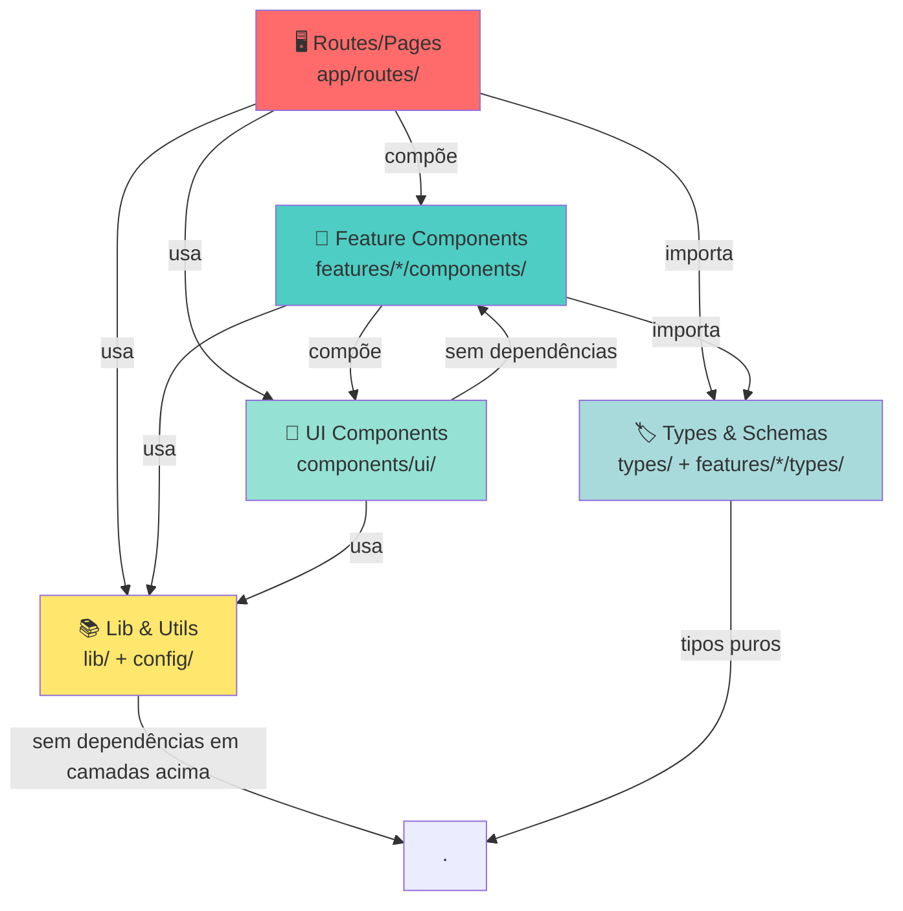
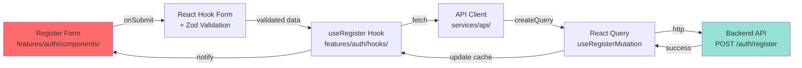

# Quyro Tech - Frontend Architecture

> Padrão oficial de arquitetura front-end da Quyro Tech. Uma documentação viva que descreve a estrutura, padrões e princípios de design de componentes e aplicações.


---

## Sumário

- [Visão Geral](#visão-geral)
- [Estrutura do Projeto](#estrutura-do-projeto)
- [Arquivos de Configuração](#arquivos-de-configuração)
- [Fluxo de Dados e Comunicação](#fluxo-de-dados-e-comunicação)
- [Começando](#começando)
- [Decisões Arquiteturais](#decisões-arquiteturais)
- [Convenções e Padrões](#convenções-e-padrões)

---

## Visão Geral

Este projeto define o **padrão oficial de arquitetura front-end** para todas as aplicações da Quyro Tech. É construído com **Vite**, **React 19**, **TypeScript**, **TailwindCSS** e outras tecnologias modernas.

### Objetivos Principais

- ✅ **Consistência**: Estrutura padronizada em todos os projetos
- ✅ **Escalabilidade**: Fácil crescimento e adição de features
- ✅ **Manutenibilidade**: Código limpo e bem organizado
- ✅ **Reutilização**: Componentes e utilitários compartilháveis
- ✅ **Type-Safety**: TypeScript em todo o projeto
- ✅ **Performance**: Otimizações built-in com Vite e React Query

---

## Estrutura do Projeto

```
quyro-tech-frontend-architecture/
├── public/                          # Arquivos estáticos
├── src/
│   ├── app/                        # Orquestração da aplicação
│   │   ├── index.tsx               # Entry point do React App
│   │   ├── Router.tsx              # Configuração de rotas (React Router v7)
│   │   └── routes/                 # Páginas/Rotas da aplicação
│   │       ├── Home.tsx
│   │       ├── NotFound.tsx
│   │       └── auth/
│   │           └── Register.tsx
│   ├── components/                 # Componentes genéricos
│   │   └── ui/                     # Primitivos de UI (Shadcn style)
│   ├── config/                     # Configurações globais
│   │   ├── env.ts                  # Variáveis de ambiente
│   │   └── paths.ts                # Definição de rotas centralizada
│   ├── features/                   # Funcionalidades por domínio
│   │   └── auth/
│   │       ├── api/                # Chamadas de API (serviços)
│   │       ├── components/         # Componentes locais da feature
│   │       ├── schemas/            # Validações Zod
│   │       └── types/              # Tipos específicos da feature
│   ├── lib/                        # Instâncias de bibliotecas e utils
│   │   ├── axios.ts                # Configuração do cliente HTTP
│   │   ├── reactQuery.ts           # Configuração do TanStack Query
│   │   └── utils.ts                # Helpers (ex: cn)
│   ├── providers/                  # Provedores de contexto globais
│   │   ├── AppProviders.tsx        # Wrapper de todos os provedores
│   │   └── QueryProvider.tsx       # Configuração do React Query Provider
│   ├── types/                      # Tipos globais e de domínio
│   │   └── user.ts
│   ├── main.tsx                    # Mount point do React
│   └── index.css                   # Estilos globais
├── biome.json                      # Linter/Formatter
├── package.json                    # Scripts e dependências
└── vite.config.ts                  # Configuração do build tool
```

### Descrição Detalhada das Pastas

#### `src/app/`
**Responsabilidade**: Gerenciar o ciclo de vida e roteamento da aplicação.
- `index.tsx`: Monta a aplicação envolvendo o `AppProviders` e o `Router`.
- `Router.tsx`: Define a hierarquia de rotas usando React Router v7 com suporte a `lazy loading`.

#### `src/providers/`
**Responsabilidade**: Centralizar todos os contextos globais.
- `AppProviders.tsx`: Componente "mestre" que encapsula a aplicação com todos os providers necessários (Query, Auth, Theme, etc).
- `QueryProvider.tsx`: Configura o `QueryClient` do TanStack Query.

#### `src/features/`
**Responsabilidade**: Agrupar lógica por domínio de negócio. Cada feature é um ecossistema independente.
- `api/`: Centraliza as chamadas de backend usando a instância do `axios`.
- `components/`: Componentes que só fazem sentido dentro desta feature.
- `schemas/`: Definições de contrato e validação usando `Zod`.
- `types/`: Tipos específicos da feature.

#### `src/lib/`
**Responsabilidade**: Configuração de bibliotecas externas e utilitários transversais.
- `axios.ts`: Instância configurada com `baseURL`, interceptors e headers padrão.
- `reactQuery.ts`: Configuração do `QueryClient` do TanStack Query.
- `utils.ts`: Funções como `cn` (Tailwind Merge + Clsx).

#### `src/config/`
**Responsabilidade**: Constantes e configurações de ambiente.
- `env.ts`: Valida e exporta variáveis de ambiente de forma tipada.
- `paths.ts`: Enumera todas as rotas da aplicação para evitar strings mágicas.

#### `src/components/ui/`
**Responsabilidade**: Componentes genéricos de UI (Button, Input, Card, etc.).
- Sem dependências de features específicas.
- Props genéricas e reutilizáveis.
- Estilizados com TailwindCSS e `class-variance-authority`.

#### `src/types/`
**Responsabilidade**: Tipos globais e de domínio.
- Tipos como `User`, `Role`, etc.
- Compartilhados entre features.
- Tipos específicos de features ficam em `features/*/types/`.

## Arquivos de Configuração

| Arquivo | Propósito |
|---------|-----------|
| `package.json` | Scripts e dependências do projeto |
| `vite.config.ts` | Configuração do Vite com suporte a React, Tailwind e alias `@/src` |
| `tsconfig.json` / `tsconfig.app.json` | TypeScript com `target: es2023`, `jsx: react-jsx`, `noUnusedLocals` ativado |
| `biome.json` | Linter/Formatter: tabs, 120 chars, CRLF |
| `components.json` | Metadados para Shadcn UI |

### Variáveis de Ambiente

Definir em `.env.local`:
```env
VITE_API_URL=http://localhost:3000/api
```

Acessar via `src/config/env.ts`:
```typescript
export const env = {
  API_URL: import.meta.env.VITE_API_URL,
  IS_DEV: import.meta.env.DEV,
  IS_PROD: import.meta.env.PROD,
};
```

## Fluxo de Dados e Comunicação

1. **Route** (`src/app/routes/auth/Register.tsx`) → Renderiza a página.
2. **Feature Component** (`src/features/auth/components/RegisterForm.tsx`) → Composição do formulário.
3. **Validation** (`src/features/auth/schemas/register.schema.ts`) → Define o contrato.
4. **API Call** (`src/features/auth/api/register.ts`) → Usa `axios` com TanStack Query.
5. **Global State** (via `AppProviders` em `src/providers/AppProviders.tsx`) → Gerencia estado cacheado.

### Fluxo Prático

```typescript
// 1. Define o schema
// features/auth/schemas/register.schema.ts
export const RegisterSchema = z.object({
  name: z.string().min(2),
  email: z.string().email(),
  password: z.string().min(8),
});

// 2. Cria o componente de formulário
// features/auth/components/RegisterForm.tsx
import { RegisterSchema } from '../schemas/register.schema';

export default function RegisterForm() {
  const { register, handleSubmit } = useForm({
    resolver: zodResolver(RegisterSchema),
  });
  // ...
}

// 3. Faz a chamada de API
// features/auth/api/register.ts
export const useRegister = () => {
  const queryClient = useQueryClient();
  return useMutation({
    mutationFn: (data: RegisterFormData) =>
      axios.post('/auth/register', data).then(res => res.data),
    onSuccess: () => queryClient.invalidateQueries({ queryKey: ['auth'] }),
  });
};

// 4. Usa no componente de página
// app/routes/auth/Register.tsx
import RegisterForm from '@/features/auth/components/RegisterForm';
export default function RegisterPage() {
  return <RegisterForm />;
}
```

---
   - Usa `react-hook-form` com resolver `zodResolver`
   - Define schema de validação em `register.schema.ts`
---

## Começando

### Pré-requisitos

- Node.js 18+ (recomendado 20+)
- npm, yarn ou pnpm

### Instalação

```bash
# Clone o repositório
git clone <repository-url>
cd quyro-tech-frontend-architecture

# Instale dependências
npm install
```

### Desenvolvimento

```bash
# Inicie o dev server (hot reload automático)
npm run dev
```

Acesse a aplicação em `http://localhost:5173`

### Build para Produção

```bash
# Compila TypeScript e faz build com Vite
npm run build

# Visualiza build antes de deployar
npm run preview
```

### Formatação de Código

```bash
# Formata todo código em src/
npm run biome
```

---

## Decisões Arquiteturais

### 1. **Organização por Features**
**Decisão**: Usar pasta `features/` para agrupar código relacionado por domínio

**Justificativa**:
- Escalabilidade: Fácil adicionar novas features sem impactar estrutura
- Modularidade: Features são independentes e podem ser movidas/removidas
- Colaboração: Times podem trabalhar em features separadas sem conflito

**Exemplo**:
```
features/auth/     # Toda lógica de autenticação junto
features/dashboard/ # Toda lógica de dashboard junto
features/payments/  # Toda lógica de pagamentos junto
```

---

### 2. **Componentes de UI Separados**
**Decisão**: Manter componentes primitivos em `components/ui/` separado de features

**Justificativa**:
- Reutilização: Button, Input, Card podem ser usados em múltiplas features
- Manutenção: Mudanças em componentes base afetam tudo (bom para consistência)
- Biblioteca: Fácil exportar como design system

---

### 3. **Alias Path `@/`**
**Decisão**: Usar alias `@` para imports em vez de paths relativos

**Não fazer**:
```typescript
import { Button } from '../../../components/ui/button';
```

**Fazer**:
```typescript
import { Button } from '@/components/ui/button';
```

**Justificativa**:
- Readabilidade: Claro onde o arquivo está
- Refatoração: Mover arquivo não quebra imports
- Consistência: Sempre mesmo padrão

---

### 4. **Validação com Zod + React Hook Form**
**Decisão**: Usar Zod para schemas + React Hook Form para estado

**Justificativa**:
- Type-safety: `z.infer<typeof Schema>` gera tipos automaticamente
- Validação centralizada: Schema é única fonte de verdade
- UX: Validação em tempo real com erro específico

---

### 5. **React Query para Estado Async**
**Decisão**: Usar `@tanstack/react-query` para gerenciar fetches de API

**Benefícios**:
- Caching automático
- Refetch on focus
- Retry automático
- DevTools para debug

**Configuração centralizada** em `lib/reactQuery.ts`:
```typescript
export const queryConfig = {
  queries: {
    refetchOnWindowFocus: false,
    retry: false,
    staleTime: 1000 * 60, // 1 minuto
  },
};
```

---

### 6. **TypeScript Strict Mode**
**Decisão**: Forçar `noUnusedLocals`, `noUnusedParameters`, type safety máxima

**Benefícios**:
- Evita código morto
- Força tipos explícitos
- Menos bugs em runtime

---

### 7. **Tailwind + CVA para Styling**
**Decisão**: Usar TailwindCSS com `class-variance-authority` para variantes

**Exemplo**:
```typescript
const buttonVariants = cva(
  "base-styles",
  {
    variants: {
      variant: {
        default: "bg-primary text-white",
        outline: "bg-white border",
      },
      size: {
        sm: "px-2 py-1",
        lg: "px-4 py-2",
      },
    },
  }
);
```

**Benefícios**:
- Type-safe component props
- Sem duplication de estilos
- Fácil manutenção

---

### 8. **Roteamento com React Router v7**
**Decisão**: Usar React Router v7 com lazy loading de componentes

**Beneficios**:
- Code splitting automático
- Carregamento sob-demanda de routes
- Integração com React Query via loaders

```typescript
{
  path: '/auth/register',
  lazy: () => import('./routes/auth/Register').then(convert(queryClient)),
}
```

---

## Convenções e Padrões

### Nomenclatura de Pastas

| Pasta | Convenção | Exemplo |
|-------|-----------|---------|
| Features | `lowercase` | `auth`, `dashboard`, `payments` |
| Componentes | `CamelCase` | `RegisterForm.tsx`, `UserCard.tsx` |
| Tipos | `camelCase` (tipos) ou `PascalCase` (interfaces) | `auth.types.ts`, `user.ts` |
| Schemas | `camelCase` + `.schema.ts` | `register.schema.ts`, `login.schema.ts` |
| Utilitários | `camelCase` + `.ts` | `utils.ts`, `helpers.ts` |

---

### Nomenclatura de Arquivos

**Componentes React**: `PascalCase.tsx`
```typescript
RegisterForm.tsx     ✅
register-form.tsx    ❌
registerForm.tsx     ❌
```

**Tipos TypeScript**: `camelCase.ts`
```typescript
auth.types.ts        ✅
Auth.types.ts        ❌
authTypes.ts         ❌
```

**Schemas**: `featureName.schema.ts`
```typescript
register.schema.ts   ✅
RegisterSchema.ts    ❌
registerSchema.ts    ❌
```

---

### Estrutura de Componentes React

```typescript
import { ReactNode } from 'react';
import { cn } from '@/lib/utils';

// Props
interface ButtonProps extends React.ComponentProps<'button'> {
  variant?: 'primary' | 'secondary';
  size?: 'sm' | 'lg';
  children: ReactNode;
}

// Componente
export function Button({ 
  variant = 'primary', 
  size = 'sm', 
  className,
  children,
  ...props 
}: ButtonProps) {
  return (
    <button
      className={cn(buttonVariants({ variant, size }), className)}
      {...props}
    >
      {children}
    </button>
  );
}
```

**Padrões**:
- Props interfaces explícitas
- Default values para variantes
- Spread `...props` para flexibilidade
- `cn()` para merge de classes

---

### Estrutura de Features

```typescript
// features/auth/types/auth.types.ts
export type RegisterResponse = {
  user: User;
  token: string;
};

// features/auth/schemas/register.schema.ts
import { z } from 'zod';

export const RegisterSchema = z.object({
  name: z.string().min(2),
  email: z.string().email(),
  password: z.string().min(8),
});

export type RegisterFormData = z.infer<typeof RegisterSchema>;

// features/auth/components/RegisterForm.tsx
import { RegisterSchema, type RegisterFormData } from '../schemas/register.schema';
import { Button } from '@/components/ui/button';

export default function RegisterForm() {
  // Componente aqui
}
```

**Padrões**:
- Tipos em `types/`
- Schemas em `schemas/`
- Componentes em `components/`
- Imports internos da feature via paths relativos
- Imports externos via alias `@/`

---

### Estrutura de Rotas

```typescript
// src/app/routes/auth/Register.tsx
import RegisterForm from '@/features/auth/components/RegisterForm';

export default function RegisterRoute() {
  return (
    <div className="container mx-auto py-8">
      <h1>Criar Conta</h1>
      <RegisterForm />
    </div>
  );
}

// Opcional: Loaders/Actions para React Router
export async function clientLoader({ queryClient }) {
  // Pre-fetch data antes de renderizar
  return queryClient.ensureQueryData({
    queryKey: ['auth', 'register-info'],
    queryFn: () => fetch('/api/auth/register-info'),
  });
}
```

---

## 📊 Hierarquia de Camadas



**Regras de Dependência**:
1. ✅ Routes podem usar features, componentes e libs
2. ✅ Features podem usar UI components e libs
3. ✅ UI components são puros e sem dependências
4. ❌ UI components NÃO podem importar de features
5. ❌ Libs NÃO dependem de componentes ou features

---

## 🔗 Fluxo de Requisições (Futuro com Backend)



---

## 📖 Próximos Passos

### Para Adicionar uma Nova Feature

1. **Crie a estrutura**:
   ```bash
   src/features/novaFeature/
   ├── components/
   ├── schemas/
   ├── services/    (chamadas de API)
   ├── hooks/       (React hooks customizados)
   └── types/
   ```

2. **Defina tipos** em `types/novaFeature.types.ts`

3. **Crie schemas Zod** em `schemas/`

4. **Implemente componentes** em `components/`

5. **Crie rotas** em `src/app/routes/`

6. **Registre rotas** em `src/app/Router.tsx`

### Para Adicionar um Novo Componente UI

1. Crie em `src/components/ui/nomeComponente.tsx`
2. Exporte de forma clara com props tipadas
3. Use `class-variance-authority` para variantes
4. Documente props com comentários
5. Use em múltiplas features para validar reutilização

---

## 🤝 Contribuindo

### Checklist de Review

- [ ] Código segue convenções de nomenclatura
- [ ] Types estão corretos (sem `any`)
- [ ] Componentes são puros e reutilizáveis
- [ ] Imports usam alias `@/`
- [ ] Código foi formatado com `npm run biome`
- [ ] Linter não teve erros

---

## 📞 Suporte

Para dúvidas sobre arquitetura ou padrões, consulte esta documentação ou entre em contato com o time de arquitetura.

---

**Última atualização**: Maio 2026  
**Versão**: 1.0.0  
**Status**: Produção ✅
